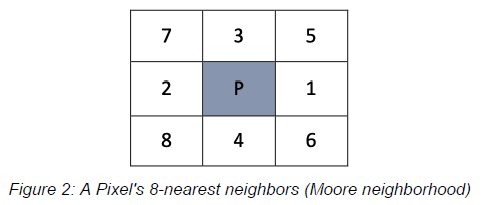
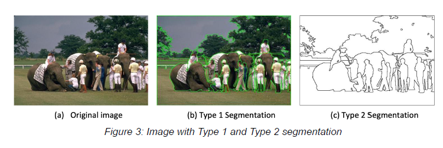

# Project 3

## Goal:

- Image Segmentation for colour image by multiobjective GA
- partition an image into separate regions of pixels, which ideally correspond to different real-world objects
- Consider the 8 nearest neighbors to a pixel during segmentation (1 depth)
- Segments:
    - Homogeneity within a segment: Similarities
    - Heterogeneity between neighboring segments: distinct differences
- Segmentation types
    - Type 1: Green outline over original image for the segments
    - Type 2: Only outline (black) for the segments

Algo: NSGA-II

## Implementation Details

- Store pixels by their color values from a color space (RGB / CIE L\*a\*b)
- Genotype: Representation togheter with a conversion from genotype to phenotype (image)
    - Graph-based / tree-based
    - E.g.:
        - C: Set of all segments
        - Pixels are indexed i..N
        - All pixels are assigned to segments
        - Each segment's average pixel color value is denoted the centroid
        - Neighboring pixels for a pixel i is denoted F
- Goal: Optimize several objective:
    - Edge value: How clear the boundaries of the segments are in the image.
        - Clear boundary: image location of discontinuity in gray or color levels.
        - Subject to **Maximization**
        - The distrance function: Euclidean distance
        - Objective: Draw lines between two segments
    - Connectivity: How connected the nighboring pixels are
        - Evaluates the degree to which neighboring pixels have been placed in the same segment
        - Subject to **Minimization**
        - Objective:
    - Deviation: similarity of pixels in the same segment
        - expresses the compactness of segments by providing the overall sum for all segments of the distance between
          every pixel and the center value (centroid)
        - Subject to **Minimization**
        - Objective: Achive compact segments
- Objective function: Each objective function should be chosen to balance each other’s tendency to increase or decrease
  the number of segments.
    - Naturally, edge value and overall-deviation improves with an increasing number of segments (reduced distance)
      while the connectivity would decrease heavily
- Note: every pixel must belong to a segment, and be encapsulated by a black boarder in type 2 segmentation
    - Thus, a square outside border should be present in all your solutions if the image segmentation algorithm is
      implemented correctly.
- Must produce two types of segmentation solutions for each test image: type 1 and type 2
    - Must be produced for each member of the set of Pareto optimal solutions for that image (all the best solutions,
      not only THE BEST)

## Benchmark

TODO

## Sources

TODO
